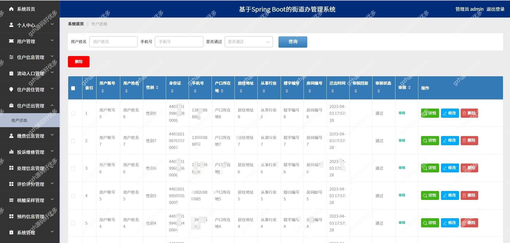

# springbootA323
springbootA323街道办管理系统
 
## 查看主页获取源码

### 一、关键词
街道办管理系统 街道办系统

### 二、作品包含
源码+数据库+万字设计文档+PPT+全套环境和工具资源+本地部署教程

### 三、项目技术
前端技术：Html、Css、Js、Vue2.0、Element-ui 
后端技术：Java、SpringBoot2.0、MyBatis

### 四、运行环境（以下版本亲测，其他版本兼容性请自行测试）
开发工具：IDEA/eclipse  + VSCODE
数据库：MySQL5.7

数据库管理工具：Navicat10以上版本

环境配置软件： JDK1.8 + Maven3.6.3

前端Nodejs：14

浏览器：谷歌浏览器

### 五、项目介绍
项目编号：springbootA323

随着世界经济信息化、全球化的到来和互联网的飞速发展，推动了各行业的改革。若想达到安全，快捷的目的，就需要拥有信息化的组织和管理模式，建立一套合理、动态的、交互友好的、高效的街道办管理系统

以需求为依据，根据需求分析结果进行了系统的设计，并将其划分为管理员和用户二种角色和多个主要模块：用户、住户信息、流动人口、住户居住、住户迁出、缴费信息、投诉维修理、处理信息、评价评分、核酸采样、预约信息等

### 六、运行截图

